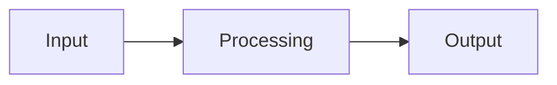

# My Project

[](#)
[](#)
[](#)

## Overview
Briefly describe your project’s purpose, main features, and its intended audience or use cases.

## Features
- Highlight core functionalities or modules.  
- Summarize key benefits for end-users.

## Architecture Diagram


## Usage
1. Download or clone the repository.  
2. Install dependencies:  
   ```bash
   npm install
   ```
3. Run the project:  
   ```bash
   npm start
   ```

## Contributing
Pull requests are welcome. For major changes, open an issue first to discuss potential updates.